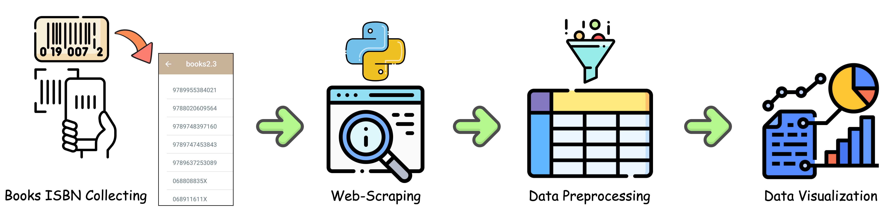
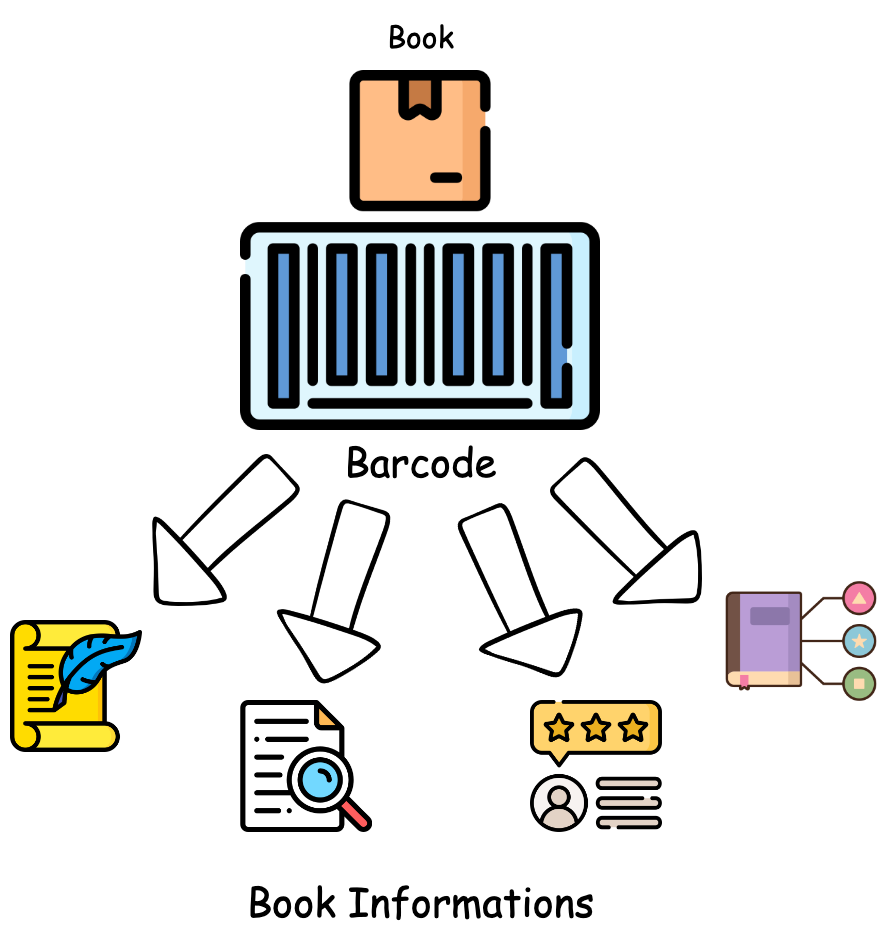
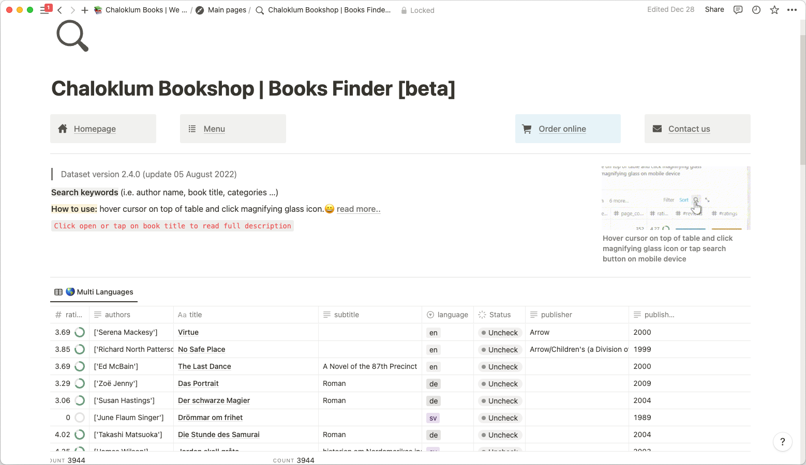
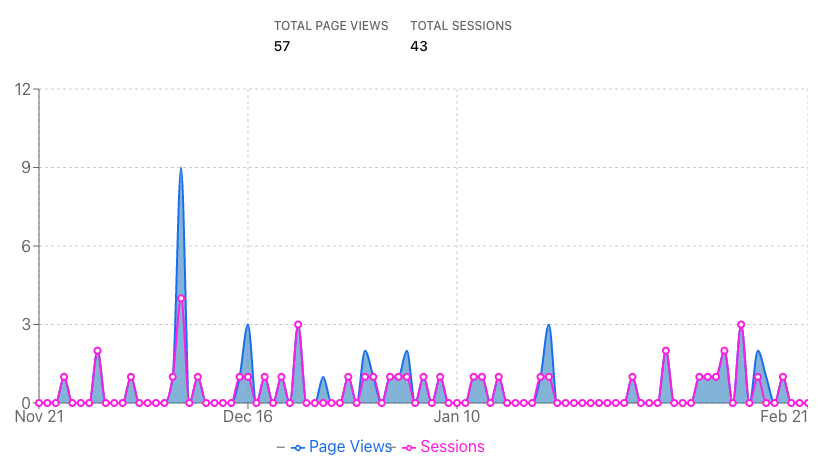
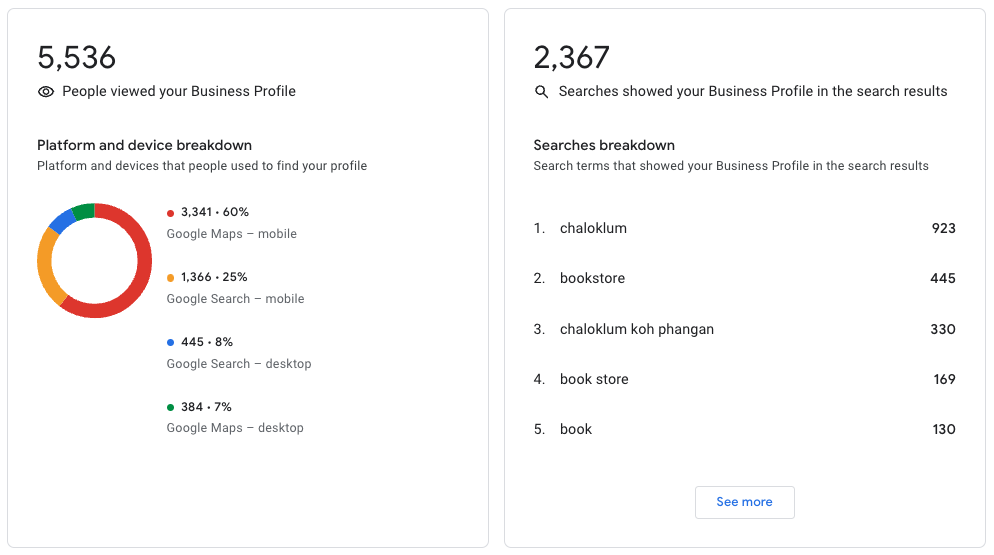
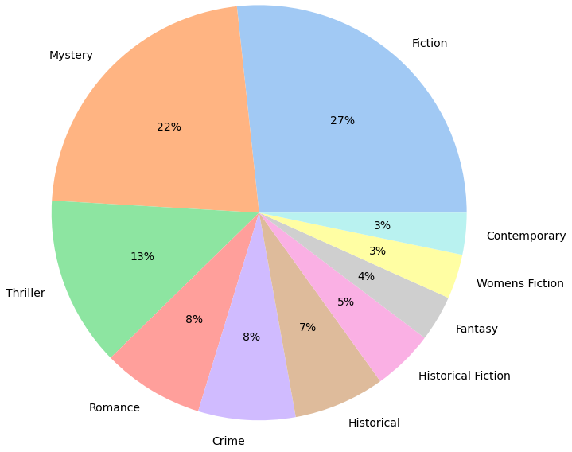
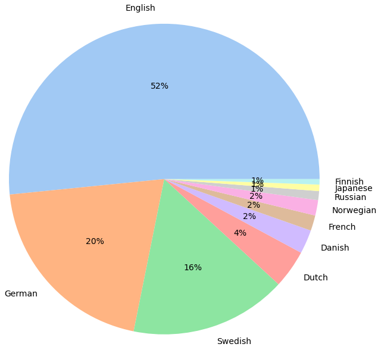
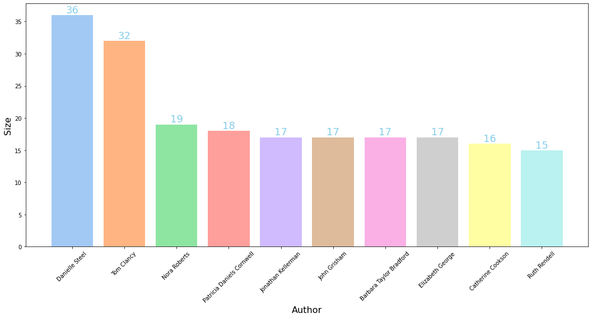

# Pathompong Muangthong
**Phone:** `(+66)062-063-6060` <br/>
**Email:** `pathompong.workspace@gmail.com` <br/>

<p align="left">

<a href="mailto:pathompong.workspace@gmail.com">
    
</a>
<a href="https://www.linkedin.com/in/pathompong-muangthong/">
    
</a>
<a href="https://github.com/p4zaa/Social-Recommendation-Based-on-Weighted-Graph">
    
</a>  

## Introduction


<p align='justify'>
I am a computer science graduate with a passion for machine learning and deep learning. My expertise in programming languages and my year of research experience have provided me with a strong foundation in the field. I have hands-on experience in developing and improving ML models and continue to expand my skills through personal projects. I am proficient in various programming languages, frameworks, and tools, and am eager to continue learning and growing in this field. My goal is to use my skills to contribute to meaningful projects and deliver results that drive progress and innovation. <br/>
</p>
<br clear="left"/>

## Technical Skills
| | |
| --- | --- |
| **Programming Languages** | `Python` `SQL` `Java` |
| **Machine Learning Frameworks/Libraries** | `PyTorch` `TensorFlow` `PyTorch Geometric` `Gensim` |
| **Data Visualization** | `Pandas` `Matplotlib` `Seaborn` `Plotly` `NetworkX` |

## Education
> May 2018 - August 2022
### Bachelor of Science in Computer Science
*Chulalongkorn University, Bangkok* <br/>

**Relevant Coursework:** `Hands-On Machine Learning`, `Mathematical Perspectives on Machine Learning Algorithms`, `Artificial Intelligence and Expert Systems`, `Database Systems`, `Linear Algebra`, `Software Engineering Methodology and Development` <br/>

## Projects
> December 2020 - May 2022
### Social Recommendation Based on Weighted Graph
**Keywords:** `Social Recommendation` `Graph Neural Network` <br/>
**Tools/Frameworks:** `Python` `TensorFlow` `Pandas` <br/>
**Dataset:** [Yelp Open Dataset](https://www.yelp.com/dataset) <br/>

<p align="left">

<a href="https://github.com/p4zaa/Social-Recommendation-Based-on-Weighted-Graph">
    
</a>  

<p align="justify">
The objective of this senior project was to develop a social recommendation method based on weighted graphs, combining user influence graph and user interest graph. The project was conducted over a period of one year, with the guidance and advice of an expert advisor in the field of machine learning and deep learning. <br/>
</p>

<p align="justify">
The social recommendation method was evaluated using Hit Ratio and Normalized Discounted Cumulative Gain metrics on the Yelp open dataset, which consisted of a minimum of 5,000 users and 40,000 items. The results showed that the social recommendation method based on weighted graphs improved the effectiveness compared to the “A Neural Influence and Interest Diffusion Network for Social Recommendation” (<a href='https://arxiv.org/abs/2002.00844' >DiffNet++</a>) method. <br/>
</p>

<p align="justify">
As the sole participant in this project, I took on a range of responsibilities, from researching relevant research papers to data preparation and model development. With the support of my advisor, I modified the DiffNet++ source code to be compatible with the latest versions of Python and TensorFlow libraries, as well as preprocessed the data. My key contributions included proposing a weighted graph as part of the social recommendation method and improving the performance of the baseline model. <br/>
</p>

|  |  |
|:-----------:|:-----------:|
|**User Influence Graph**<br/>(User-User)|**User Interest Graph**<br/>(User-Item)|

#### Baseline Model Architecture:
|  |
|:-----------:|
|**The Diagram of DiffNet++ Model Architecture by Pathompong Muangthong**|

#### Proposed Methodology:
|  |  |
|:-----------:|:-----------:|
|**Non-Weighted Graph**<br/>(Baseline method)|**Weighted Graph**<br/>(Proposed method)|

#### Graph-Based Model Advantages:
  - Graph can handle large amounts of data.
  - Graphs can represent complex relationships between entities clearly and intuitively.
  - My proposed weight calculation can provide a meaningful perspective in the graph-based model.

#### Comparison between baseline model and weighted graph model on Yelp dataset.
|  |
|:-----------:|

#### Tables illustrated the evaluation scores on HitRate (top) and NDCG (lower) in each test round.
|  |  |
|:-----------:|:-----------:|
|  |  |

#### Result:
  - The average scores in HitRate and NDCG metrics indicate that the proposed model (DiffNet++ with weighted graph) performed better than the baseline model, but the improvement was not significant.
  
<p align='justify'>
Although my proposed model showed promising results, it did not outperform the baseline model as expected. Further improvements and optimization are needed to achieve better performance. This project demonstrates my expertise in graph neural networks, deep learning, and recommendation systems, as well as my ability to work independently and lead a research project from start to finish.
</p>
  
---
> December 2022 - January 2023
### OTTO Multi-Objective Recommender System using Link Prediction
**Keywords:** `Large-scale e-commerce data` `Graph Neural Network` `Link Prediction` <br/>
**Tools/Frameworks:** `Python` `PyTorch` `PyTorch Geometric` `Pandas` `Polars` <br/>
**Dataset:** [OTTO Recommender Systems Dataset]([https://www.yelp.com/dataset](https://github.com/otto-de/recsys-dataset)) <br/>

<p align="left">

<a href="https://github.com/p4zaa/OTTO-Multi-Objective-Recommender-System">
    
</a>  
    
<p align="justify">
In this project, I participated in the OTTO Kaggle competition to develop a Multi-Objective Recommender System using a Link Prediction Approach. The dataset used in the competition consisted of 12 million real-world user sessions, 220 million events, and 1.8 million unique articles in the catalog. <br/>
</p>

<p align="justify">
I took the initiative to study and work on this project independently, which allowed me to expand my knowledge and skills in the field of machine learning and data processing. I utilized the PyTorch framework and the PyTorch Geometric library to implement Graph Neural Networks. Furthermore, I optimized the code and model to run efficiently on a CUDA GPU and used Polars as the DataFrame library for maximum GPU and memory efficiency. <br/>
</p>

<p align="justify">
The main objective of the competition was to build a multi-objective link prediction on a large-scale e-commerce heterogeneous graph. I utilized graph neural networks and link prediction techniques to recommend the most relevant articles to users based on their preferences and past behaviors. <br/>
</p>

|  |
|:-----------:|
|An illustration of the heterogeneous graph (left) which consists of multiple node and edge types and multi-objective recommendations (right) which takes prediction on multiple event types and items.|

<table>
<tr>
<td> Graph data stored in HeteroData class </td> <td> Using RandomLinkSplit to split the data in link-level </td>
</tr>
<tr>
<td>

```python
>>> data
HeteroData(
  session={
    num_nodes=14571582,
    x=[14571582, 32]
  },
  aid={ x=[1855603, 32] },
  (session, event, aid)={
    edge_index=[2, 223644219],
    edge_label=[223644219]
  },
  (aid, rev_event, session)={ edge_index=[2, 223644219] }
)
```

</td>
<td>
    
```python
# Perform a link-level split into training, validation, and test edges:
train_data, val_data, test_data = T.RandomLinkSplit(
    num_val=0.1,
    num_test=0.1,
    neg_sampling_ratio=0.0,
    edge_types=[('session', 'event', 'aid')],
    rev_edge_types=[('aid', 'rev_event', 'session')],
)(data)
```
</td>
</tr>
</table>

#### Result:
    - Achieved a Recall@20 score of 0.486 for my custom link prediction model.
    - Achieved a Recall@20 score of 0.511 for my Node2Vec model.
    - Both models indicate a need for improvement and optimization.

<p align="justify">
To further improve the model's accuracy and efficiency, I plan to optimize it and explore alternative approaches. I am also interested in exploring a similar implementation using TensorFlow to expand my knowledge of different frameworks. This project has opened up new avenues for me to continue developing my expertise in graph-based models and recommender systems.
</p>

---
> August 2022 - September 2022
### A Local Bookstore Data Collecting and Scraping
**Keywords:** `Web-Scraping` `Data Collecting` `Data Visualization` <br/>
**Tools/Frameworks:** `Python` `Pandas` `Matplotlib` `BeautifulSoup` <br/>
**Dataset:** [My Dataset Provided on Kaggle](https://www.kaggle.com/datasets/pathompongmuangthong/chaloklum-bookshop-dataset) <br/>

<p align="left">

<a href="https://github.com/p4zaa/Chaloklum-Books">
    
</a>  
    
<p align="justify">
The Chaloklum Bookshop in Koh Phangan, Thailand sells over 4000+ second-hand books in multiple languages such as English, German, and French. The bookstore has been operating for many years but never recorded any information about the books. To address this issue, I took the initiative to gather information by scanning the books' barcodes using my smartphone and extracting their ISBNs. The ISBNs were then utilized to retrieve information about the books from sources such as Google Books API and Goodreads, utilizing Python and several libraries. The collected data underwent preprocessing and was provided as a dataset on Kaggle, accompanied by simple data visualizations for better understanding. The final dataset comprises information on approximately 4000 books. With this information, I was able to create a book search website for customers to easily find the books they are looking for.
 <br/>
</p>

| Workflow |
|:----------:|
||

|||
|:----------:|:----------:|
|An illustration show that I can scrap book details from ISBN number.|A screenshot of the books searching page made on Notion.|

|||
|:----------:|:----------:|
|A screenshot of the books searching site traffic from November 2022 - February 2023|A screenshot of Google Bussiness performance show that the engagement improved compared to the same period last year.|


||||
|:----------:|:----------:|:----------:|

<p align="center">
An example of bookstore data visualizations provided on Kaggle.
</p>
    
#### Achievements
    * Providing bookstore searching sites for customers.
    * Providing bookstore dataset on Kaggle
    * Visualizing some statistics of the books in the store.
    * Increase business engagement on Google Search.

<p align='justify'>
<b>Future Work:</b> Integration of machine learning algorithms to provide a more personalized book recommendation system for customers. Additionally, the project can be integrated with the bookstore management system, allowing for seamless tracking of customer behavior and preferences, further improving the accuracy and relevance of book recommendations.
</p>

---
```python
Working on it!
```
